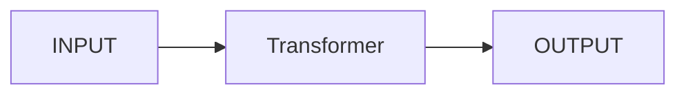
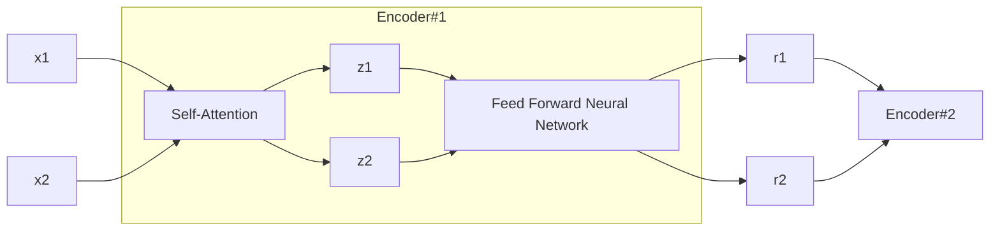

> 本篇文章于 2026.06.11 重写

> 原文： [The Illustrated Transformer](https://jalammar.github.io/illustrated-transformer/)

## 前言

作为现代 LLM 的基石，我们有必要了解并学习一下 Transform，它最早是在 2017 年发布的论文 [Attention Is All You Need](https://arxiv.org/abs/1706.03762) 中被提出来的。

原文章从一个黑盒的角度出发，到 Encoder 和 Decoder，再到 Self-Attention 的计算，以及多头注意力和位置编码的引入，一步步刨开 Transform 模型。

## 模型架构组成

首先，我们从翻译的角度去出发，INPUT -> Transform -> OUTPUT，再详细拆开 Transform，里面是 Encoders 和 Decoders，原论文中这里的数量都是6个。

每个 Encoder 又分为 Feed Forward Neural Network（前馈神经神经）和 Self-Attention，而 Decoder 则比 Encoder 多了 Encoder-Decoder Attention 这一层，帮助 Decoder 关注输入句子的相关部分（类似于注意力在 [seq2seq](https://jalammar.github.io/visualizing-neural-machine-translation-mechanics-of-seq2seq-models-with-attention/) 模型中的作用）

## 怎么工作

在 NLP 应用中，我们会用 embedding 算法将每个输入词转换为向量，在这里，Encoder 会接收一个 512 维向量组成的列表（这个列表是我们的训练数据集中最长句子的长度）。

经过 embedding 后的每个输入词会经过 Encoder 的 Self-Attention 和 Feed Forward。

文章中举了一个例子来展示 Encoder 每一个子层中发生的情况。

原文章中在这里提到了 Transformer 的一个关键特性，即每个位置的词在 Encoder 中通过自己的路径流动，在 Self-Attention 层之间存在依赖关系，然而在 FFNN 层没有这些依赖关系，但是没有说明原因，Attention 下面会讲到，这里简单说一下 FFNN 层，Attention 负责"信息交换"，FFNN 层负责的是"信息加工"，即看完以后如何理解这些信息，是逐 token 独立计算的，因此经过 FFNN 层时可以并行执行，大大加快了模型的速度。

## Self-Attention

"The animal didn't cross the street because it was too tired"

在这句话中 "it" 指的是什么？是指街道还是指动物，对人类来说这是个简单的问题，但是对于大模型来说却不是。

当模型处理每个单词（也就是输入序列中的每个位置）时，Self-Attention 允许它查看输入序列中的其他位置，以便更好地理解这个单词的意思。

### Attention 是怎么计算的

计算 Attention 的第一步是从 Encoder 中将 embedding 后的向量分别乘以三个可训练的权重矩阵来创建三个向量，分别是 Query，Key，Value。这里对 Q、K、V 做一个大概的解释，可以理解为 Q：我要找谁，K：谁该关注我，V：我要提供什么信息，但这不是固定定义出来的东西，也不是词向量本身。

第二步是计算一个分数，这个分数决定了在看某个位置的单词时，应将多少注意力放在输入句子的其他部分。通过将 Q 与我们要评分的相应词的 K 进行点积计算得出分数。

第三是将上一步得到的分数除以 $\sqrt{d_k}$，也就是 K 维度的平方根。这里有一个很经典的问题：为什么要除以这个 $\sqrt{d_k}$，核心原因是：防止点积结果随着维度增大而变得过大，导致 Softmax 进入饱和区间，梯度变得很小。这里不做深入探讨，简单来说就是 $QK$ 点积维度越高，产生的数值波动越大，会使 Softmax 变得饱和，从而导致训练时梯度变得很小，学习变慢，不稳定等问题，而除以 $\sqrt{d_k}$ 刚好抵消点积标准差增长。

第四步是将结果进行 Softmax 分数标准化，使它们都是正数并且总和为1。

第五步是将每个 V 乘以 Softmax分数（为将它们相加做准备），这里的直观理解是：保持我们想要关注的单词的值不变，同时通过乘以很小的数字（例如 0.001）来淹没无关的单词。

第六步则是求和加权值向量，这会产生 Self-Attention 层在此位置的输出。

于是我们完成了 Attention 的计算，得到的向量可以传递给 FFNN。

**总的公式为：**

$$
\mathrm{Attention}(Q, K, V) = \mathrm{softmax}\left(\frac{QK^T}{\sqrt{d_k}}\right)V
$$

### Multi-Headed

论文通过引入一种称为 "多头注意力" 的机制，进一步优化了 Self-Attention 层，主要提升了两个方面。

- 扩展了模型对不同位置的注意力

- 为注意力层提供了多个 "表示子空间"

简单来说就是模型需要关注更多的信息，例如语法、语义、位置关系等信息，仅仅只依靠一个 Attention 是不够的，需要拆开去各自关注，所以 Transform 使用八个注意力头，也就是多组独立的Q、K、V在不同表示空间里并行做 Attention，然后再乘以一个 $W^O$ 把结果拼起来，这样模型能够从多个角度去理解同一句话。

### 位置编码

一路看下来，我们一直在讲模型对其他位置的注意力，但是目前还并没有提到 Transform 是怎么给词建立位置关系的。实际上，Transform为每个输入 embedding 了一个位置编码向量，在 Attention 的计算期间会为 embedding 向量提供有意义的距离。

### 残差连接

在继续之前，我们还需要提及一下 Encoder 架构中的一个小细节，也就是 Self-Attention 和 FFNN 层都有一个残差连接，并随后进行层归一化处理。

所以整体架构应该是如下面所示：

Decoder 也同样拥有这些残差连接。

## Linear 层和 Softmax 层

最终 Decoder 堆栈会输出一个浮点数向量，我们如何将其转换为单词？这就是 Linear 层的作用了，它后面跟着一个 Softmax。

Linear 层是一个简单的全连接神经网络，它将 Decoder 堆栈产生的向量投影到一个称为 logits 且大得多的向量中。

假设模型有一个从训练数据集中学习到的 "词汇表"，大小为10000，这将使 logits 向量有 10000 个单元格（每个单元格对应一个独特单词的得分），然后，Softmax 层将这些得分转换为概率（所有概率都为正，且总和为 1.0）。概率最高的单元格会被选中，与之关联的单词则会被输出。

## 回顾总结

以上就是通过训练好的 Transform 进行整个前向传递的过程，模型的训练部分大概是模型使用标记过的数据集进行训练以及 Loss Function 之类的一些优化指标，在这就不作讲解了，感兴趣可以自行查阅。

这些仅仅只是 Transformer 主要概念的起点，如果想深入探究的话，可以阅读论文《Attention Is All You Need》，以及 Transformer 相关的博客文章。受限于笔者的水平以及文笔，可能有错误的地方，还望海涵。