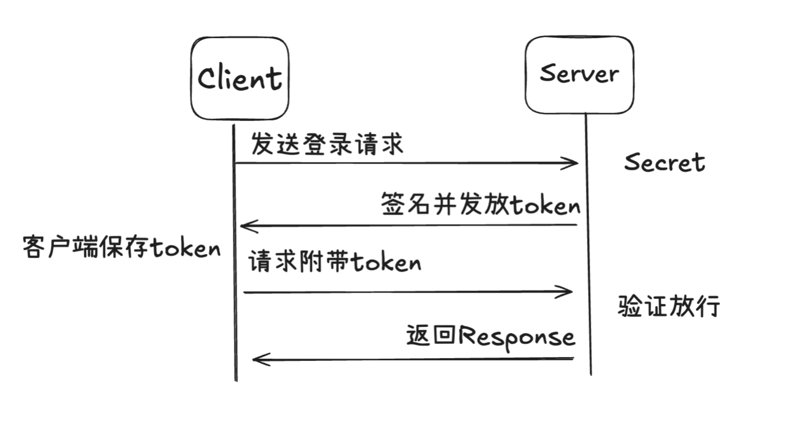

JWT(Json Web Token) 可以理解成一种**可签名的“身份证明字符串”**，包含三个请求头：
- Header
  - 描述这个 token 用什么算法签名
- Payload
  - 放你想传递的数据，也叫 claims(声明)
  - 要设置 exp 字段，否则 token 不会过期
- Signature
  - 对 Header, Payload, Secret 进行签名后的结果

```json
{
  "header": {
    "alg": "HS256",
    "typ": "JWT"
  },
  "payload": {
    "user_id": 1,
    "username": "tom",
    "exp": "1小时后"
  },
  "signature": "服务器用密钥算出来的一串签名"
}
```

Header 和 Payload 只是 Base64 编码，不是加密，所以不要存放敏感信息。

Secret 存放在服务端，用于直接进行签名验证。

## 工作流程



这样做的好处，即使 token 被拿到了，也无法伪造签名。

## JWT，session，cookie 的区别

- session 存储在服务器中，拥有一个 session_id 存放在 cookie 中。服务器收到 cookie 后解析出 session_id，再去 session 列表中查找，依赖 cookie。
- cookie 类似于一个令牌，装有 session_id，存储在客户端，浏览器通常会自动添加。
- token 也类似于一个令牌，无状态信息，用户信息都被加密到 token 中，每次请求附带 token，服务端验证通过后放行。

在传统的 session 和 cookie 的身份验证方式中，会话信息通常存储在服务端中，不同服务器之间无法共享会话信息，导致用户在不同服务器之间切换需要重新登录，增加了复杂性和额外性能开销，而引入 JWT 后，只需要在各个服务端都存储 Secret，用户拿着 token 就能够验证放行。

## 缺点

- JWT 一旦派发出去，在失效前都是有效的，没办法及时撤销 JWT。
- 如果 secret 泄露，风险很大。
- 不适合用于做非常严格的服务端会话控制。

---

## End
如果你对 JWT 感兴趣，可以玩玩看，前往 [jwt.io](https://www.jwt.io)，有 JWT Decoder 和 JWT Encoder 两种模式，分别是解密模式和加密模式。
