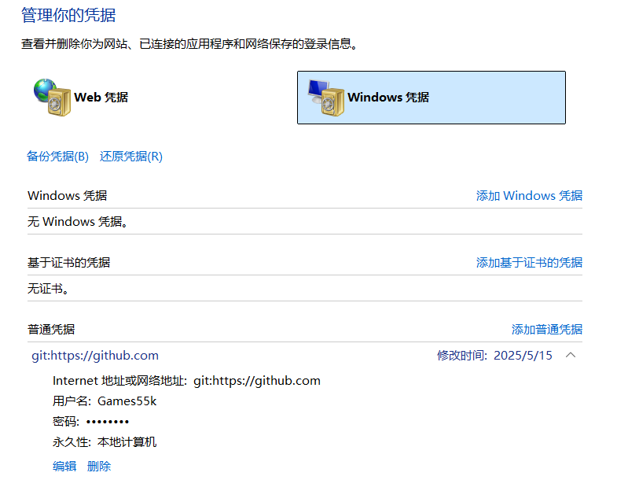

前天舍友发现从 VSCode 上 push 半天没有把本地仓库 push 上去，报错差不多如下所示：

```text
remote: You are not allowed to push code to this project
fatal: unable to access 'https://example.com/repo.git/': The requested URL returned error: 403
```

然后我开始帮他排查，试过重新重置了 git config 等方法，发现还是不成功

```bash
git config --global user.name "账号"
git config --global user.email "邮箱"
```

于是我猜测可能和 VSCode 有关，于是使用终端去尝试一下命令行 push，果不其然报错出现了两个用户名：xxx 拒绝了 xxx，原因是之前他登录过别的 GitHub 账户，和现在的不一致导致冲突了

解决方法如下：

- 打开控制面板右上角搜索 “凭据管理器”


- 然后点击管理 Windows 凭据



查看 git 的用户名和密码是否正确 or 直接删掉重新在 VSCode 登录一遍即可
